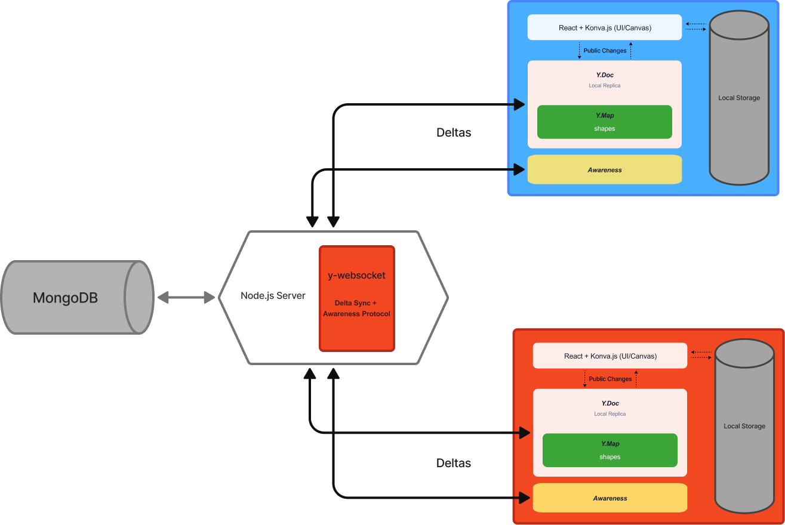

# Private Spaces in a Shared Canvas

A real-time collaborative canvas that lets users work both publicly and privately on a shared infinite canvas — without the all-or-nothing tradeoff of traditional collaboration tools.

**Live demo:** [private-spaces-canvas.vercel.app](https://private-spaces-canvas.vercel.app) &nbsp;·&nbsp; **Slides:** [View presentation](https://canva.link/z11f48la24m8gv6)

Built by Natacha Malychev, Soheil Lotfi, and Nazrin Nasirova as a CSCW (Computer-Supported Cooperative Work) programming project.

---

## The Problem

Most collaborative tools force a binary choice: either everything is shared in real time (strict WYSIWIS — What You See Is What I See), or work is fully asynchronous with no live awareness of others. There is no middle ground for users who want to think privately, prepare ideas before sharing, or explore without judgment — while still being part of a live session.

This project fills that gap.

---

## What It Does

### Shared Canvas

All connected users work on a single infinite canvas in real time. Users can:

- **Create shapes** — circles, rectangles, and stars — by clicking anywhere on the canvas
- **Move shapes** — drag individually or multi-select with Shift+Click and drag as a group
- **Recolor shapes** — select one or more shapes and pick from the color palette
- **Delete shapes** — click to select, then press Delete/Backspace or click the × button

### Group Awareness

- **Telepointers** — each user's cursor is visible to others, labeled with a randomly generated nickname (e.g. "BraveWolf") and a unique color
- **Presence Panel** — a live sidebar lists all connected users and their current mode
- **Shape Counter** — bottom-left shows total shapes on canvas, with a separate count for private shapes

### Private Mode

Users can toggle into Private Mode at any time. Upon entering, an informed consent dialog explains that changes will not be shared. While private:

- A red border and "Private" label appear around the canvas
- Your cursor disappears from other users' screens
- Your presence panel indicator switches to a lock icon
- New shapes are stored only in `localStorage` — never sent to the server
- Private shapes render with a dashed outline to distinguish them from shared ones

When you exit Private Mode by clicking **Share**, all locally stored private shapes are flushed into the shared Y.js document in a single batch transaction and become visible to everyone.

---

## System Architecture



| Layer | Technology | Role |
|---|---|---|
| Frontend | React 19 + Konva.js + React-Konva | Declarative 2D canvas rendering |
| CRDT | Y.js + nested `Y.Map` | Conflict-free real-time state sync |
| Transport | y-websocket (WebSocket) | Delta sync + Awareness protocol |
| Backend | Node.js + Express | WebSocket server, document management |
| Database | MongoDB Atlas | Durable persistence across sessions |
| Deployment | Vercel (frontend) | Public production hosting |

---

## Why Y.js (CRDT)?

The naive approach to collaborative state — broadcasting full objects and using last-write-wins — breaks under concurrent edits. For example:

| Scenario | Naive Approach | Y.js (CRDT) |
|---|---|---|
| Color change + fast drag | Works fine | Works fine |
| Two users drag overlapping multi-selections | Shape jumps unpredictably (race conditions) | Smooth merge |
| Offline editing + reconnect | Offline user overwrites online changes | Both edits preserved |

Y.js syncs **operations/deltas** rather than full object state. Each shape is stored as a nested `Y.Map`, so concurrent property updates (e.g. one user moves a shape while another recolors it) are automatically merged without conflict. The server persists the public canvas to MongoDB every 5 seconds using a dirty-flag pattern, and only non-private shapes are written to the database.

---

## CSCW Classification

| Criterion | Category | Implementation |
|---|---|---|
| Document Type | Graphics | Shared canvas for geometric shapes |
| Temporal Mode | Hybrid (Synchronous + Asynchronous) | Public mode ≈ synchronous; Private mode ≈ asynchronous |
| Software Uniformity | Homogeneous | Same web-based interface for all users |
| Awareness Level | Collaboration-Aware | Telepointers, presence panel, shape counters |

---

## Getting Started

### Prerequisites

- Node.js 18+
- A MongoDB Atlas connection string (or update `back-end/server.js` to use a local MongoDB instance)

### 1. Start the back-end

```bash
cd back-end
npm install
npm run dev     # nodemon for auto-reload
# or: npm start
```

The server listens on `http://localhost:3001`. It exposes:
- A WebSocket endpoint used by y-websocket for CRDT delta sync and cursor awareness
- MongoDB persistence (shapes saved every 5 seconds)

### 2. Start the front-end

```bash
cd private-spaces-canvas
npm install
npm run dev
```

Open `http://localhost:5173` in one or more browser tabs to test collaboration locally.

> In development, the frontend connects to `ws://localhost:3001`. In production, it falls back to `wss://demos.yjs.dev/ws`.

---

## Project Structure

```
private-spaces/
├── back-end/
│   ├── server.js          # Express + y-websocket server, MongoDB persistence
│   └── models/
│       └── shapes.js      # Mongoose schema for public shapes
└── private-spaces-canvas/
    └── src/
        ├── App.jsx        # All canvas logic, Y.js wiring, private mode
        └── App.css        # Styles
```

---

## Keyboard Shortcuts & Controls

| Action | How |
|---|---|
| Add shape | Click on the canvas |
| Move shape | Drag |
| Select shape | Click |
| Multi-select | Shift+Click or Ctrl+Click |
| Delete selected | Delete or Backspace key, or × button |
| Zoom | Scroll wheel |
| Pan | Space + drag |
| Enter Private Mode | Click "Go Private" in the toolbar |
| Share private work | Click "Share" (exits Private Mode) |
